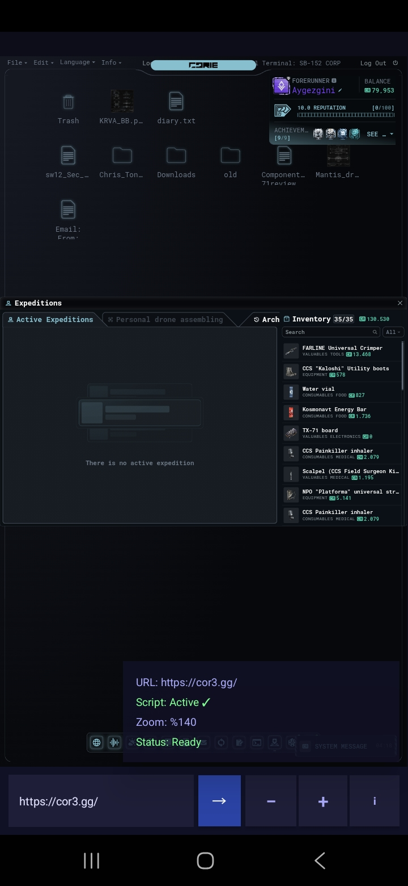

#COR3Bot 🤖

An Android automation tool for [cor3.gg](https://cor3.gg).

##Features
- Automatic expedition management
-Auto job completion
- Auto event decisions(not active yet)
- Randomly selects location, zone and objective (ready for future updates)
- Runs in the background while you sleep 💤

## Credits
- Original script by **doggo** on the COR3 Discord
- Android app built with the help of **Claude (Anthropic)**

## Installation
1. Download the APK from [Releases](../../releases)
2. Enable "Install from unknown sources" on your phone
3. Install and open the app
4. Enter cor3.gg and let it run!

## Screenshots

## Note
Use at your own risk.
 
