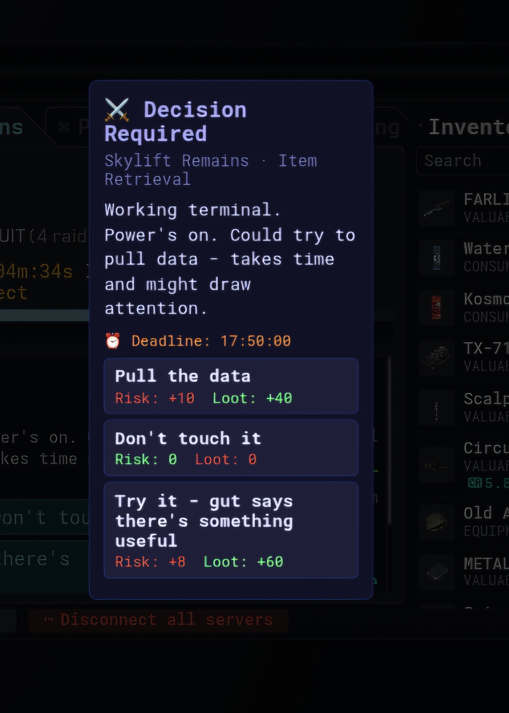

#COR3Bot 🤖

An Android automation tool for [cor3.gg](https://cor3.gg).

##Features
- Automatic expedition management
- jobs completion need to manually accept the script solves it automatically when you click file or hack without any input
- Added user decision popup for expedition events
- Randomly selects location, zone and objective (ready for future updates)

## Credits
- Original script by **doggo** on the COR3 Discord
- Android app built with the help of **Claude (Anthropic)**

## Installation
1. Download the APK from [Releases](../../releases)
2. Enable "Install from unknown sources" on your phone
3. Install and open the app
4. Enter cor3.gg and let it run!

## Screenshots

## Note
Use at your own risk.
 
